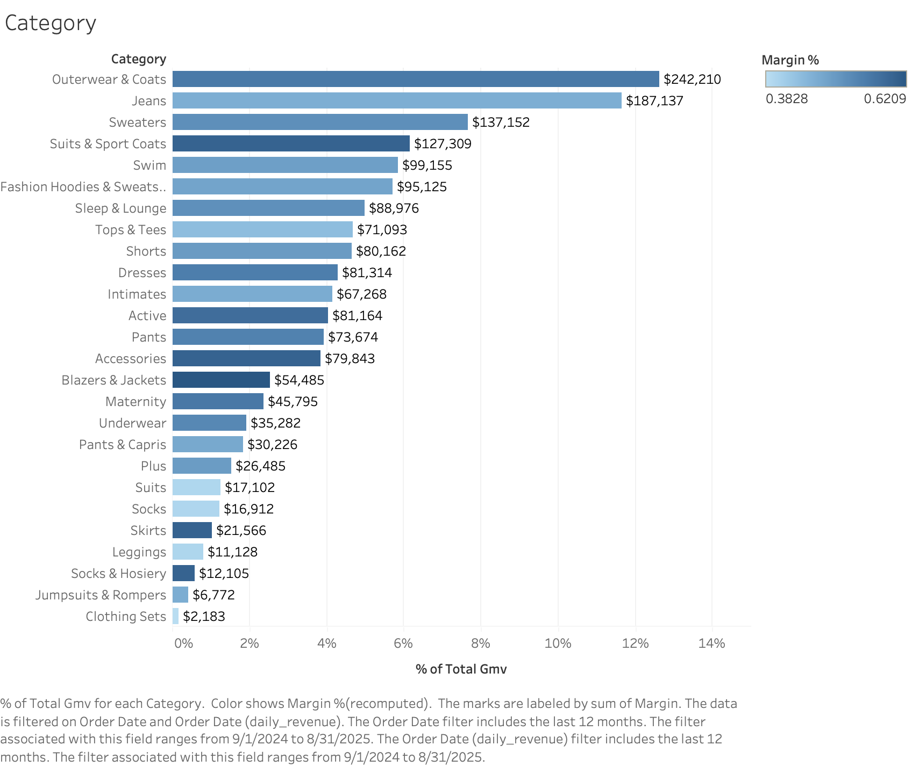

# E-commerce Analytics Portfolio — BigQuery + Tableau

**TL;DR:** A clean, reproducible analytics project that showcases SQL rigor, KPI design, and executive storytelling using the **TheLook eCommerce** public dataset (BigQuery) and **Tableau**.

Data Source: The TheLook dataset is an e-commerce dataset provided by Google Cloud Run as part of their BigQuery Public Datasets program. It contains online retail business data for 2000+ days including:
- `users` → Customer information (location, sign-up date, gender, age group, etc.).
- `products` → Product catalog (id, category, brand, department, cost, and price).
- `orders` → Order-level info (order id, user id, order status, created_at, returned/cancelled).
- `order_items` → Line-item detail for each order (sale_price, product_id, cost).
- `distribution_centers` → Warehouse locations.
- `inventory_items` → Stock levels by product/location.
- `events` → Web events (page views, clicks, conversions).

## What this project demonstrates
- End-to-end analytics: data → SQL views → Tableau dashboard → business insights
- Core KPIs: Revenue, Orders, AOV, Margin%, Category performance
- Clear **executive memo** with decisions and next steps

## Results (Screenshots)

**Overview (Revenue & Orders trend + KPIs)**


**Category Unit Economics (GMV & Margin%)**


### Quick insights (see `docs\executive_memo.md` for full details)
- Revenue up **+57.6% MoM**; Orders +56.5%; **AOV** + 85.8% for past 12 months.
- Top categories by GMV: A, B, C; **Highest Margin%**: D.

## Business questions this answers
1. **Growth**: How are revenue and orders trending? What’s the **AOV**?
2. **Unit economics**: Which categories drive **GMV** and **Margin%**?
3. **Seasonality**: What periods show spikes or dips?
4. **What drove the jump:** Orders vs AOV
5. **Next actions**: Where should we shift focus—channels, categories, pricing, or bundles?

## KPIs used (see `docs/kpi_definitions.md` for full details)
- **Revenue** — sum of sales (excl. canceled/returned)
- **Orders** — completed orders
- **AOV** — Average Order Value = Revenue / Orders
- **Margin%** — (Revenue − Cost) / Revenue
- **GMV** — Gross Merchandise Value (sum of sale_price before refunds/cancels)

---

## Steps to reproduce this project

### 1) BigQuery setup
**Where to run:** Google BigQuery Console → Query editor

> Find the thelook_ecommerce dataset from bigquery-public-data and add to your project.
> Run the view pack in `sql/bq_views.sql`. Replace `YOUR_PROJECT_ID` in `bq_views.sql` with your actual GCP project ID. Make sure your dataset is in **US** region. It creates:
- `v_daily_revenue` — daily Orders & Revenue
- `v_category_margin_daily` — category GMV/Margin by day

### 2) Tableau setup
**Where to run:** Tableau Desktop → Connect → Google BigQuery

- **Billing Project:** your GCP project
- **Project:** your GCP project
- Drag **`v_daily_revenue`** for the trend & KPIs
- Drag **`v_category_margin_daily`** for the category chart
- Alternatively, use the snippets in `sql/tableau_custom_sql.sql` via **New Custom SQL**

### 3) Business insights (how to use this repo)
- Fill in **docs/executive_memo.md** with key findings and decisions
- Keep **docs/kpi_definitions.md** as your metric source of truth
- Export final Tableau workbook to `/tableau/dashboard.twbx` (and add screenshots in `/docs/img/`)

---

## Repo structure
```
ecom-analytics-portfolio/
├─ README.md
├─ docs/
│  ├─ executive_memo.md
│  ├─ kpi_definitions.md
│  └─ img/                      # screenshots of your dashboard
├─ sql/
│  ├─ bq_views.sql
│  └─ tableau_custom_sql.sql
├─ tableau/                     # put your .twbx here
├─ .gitignore
└─ LICENSE
```

## License
MIT — see `LICENSE`.
